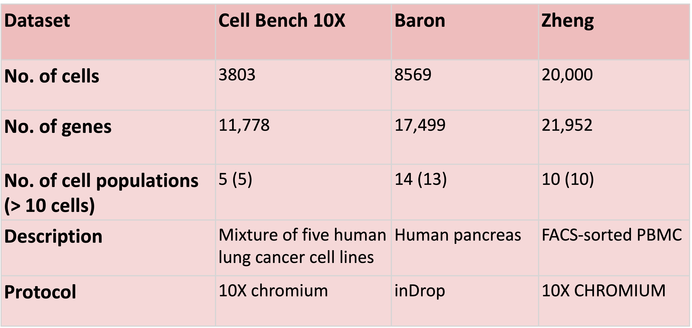
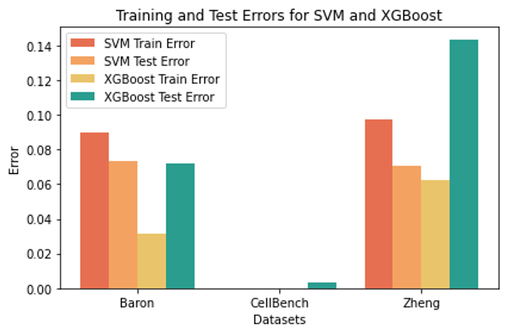

# Final project: Automated Cell Phenotyping via Machine Learning Approaches

Automated Cell Phenotyping via Machine Learning Approaches: An Evaluation on Single-cell Transcriptomics Data


## Getting Started

### Data

* Download the three [datasets](https://drive.google.com/drive/folders/1-SKsM-LK9L2UCy271y6QzFN6_-I1M3AZ?usp=sharing)
* Majority of the intermediate files are provided in this repo. However, Github doesn't allow uploading files over 100MB

| Directory  name | Description |
|--|--|
| scripts| All the scripts executed in the study, containning Juptyer Notebook file, Python and bash script|
| data | Original data collected from open source|
| data_selected | Pre-processed and feature selected data|
| clean_data | After PCA, split the data into train and test datasets|
| clean_data_nopca | In order to test the impact of PCA|
| clean_data_pca_cv | After PCA, make the cross vaildation data for supervised learning|

### Steps

1. Feature selection
2. PCA
3. Evaluate classic ML models (Kmeans, SVM, Logistic regression and XGboost) on three different human scRNA-seq datasets.
4. Use Final_Project_Results file to draw the performance comparison plots. 

### Executing program


* First run the **Final_Project_fs_cv_kmeans.ipynb**. Tips:
    * In order to make sure the code can be exeuted normally, please keep your data folder name consistent with this repo
    * For the logistic regression, simply run the **run_lr_cv.sh** to automatelly run batch cross vaildation (Already included these commands in the notebook) 
    ```
    bash run_lr_cv.sh baron
    ```
    * If you want to call the logistic regression model separately, follow this example:
    ```
    python lr_final.py ../clean_data_pca/baron/fold_1/train_features.csv ../clean_data_pca/baron/fold_1/train_labels.csv ../clean_data_pca/baron/fold_1/valid_features.csv ../clean_data_pca/baron/fold_1/valid_labels.csv metrics.txt 50 0.01
    ```
* Second, run **Final_Project_SVM_XGB_ActiveLearning.ipynb**
* Finally, run **Final_Project_Results.ipynb** to get visualization

## Methodology


## Evaluation


**Figure1** Performance comparison of models for cell identification using different scRNA-seq datasets. Heatmap of the average F1-scores across different cell populations per model (rows) per dataset (columns).


**Figure2** Test Accuracy across sampling dataset until 33% with error bar using Uncertainty Batch Sampling and random batch sampling with base learner XGBoost.



**Figure3** Training and Test Errors for SVM and XGBoost across different scRNA-seq datasets.

## Conclusion
 - We compared the cell type classification performance of classic machine learning models based on different scRNA-seq datasets.
 - Generally, all supervised classifiers perform better compared to the unsupervised clustering method. 
- Taken together, we recommend the use of the SVM model, since it has the best performance. 
- Our evaluation results could be used as a reference for bioinformatics or experimental researchers to choose an appropriate machine learning-based classifier models depending on the dataset setup at hand.

## Authors


[Yuning Zheng](https://github.com/igemiracle) (yuningz3)

[Zhuoqun Li](https://github.com/ZhuoqunLi111) (zhuoqun3)

[Mercury Liu](https://github.com/Europix) (zhishanl)

